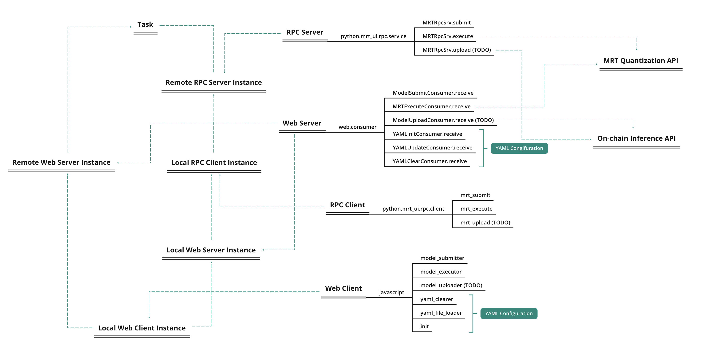

# Introduction to mrt-ui

MRT User Interface (MRT-UI) serves as an alternative to the command line operation of mrt quantization tools, which supports remote model submitting, quantization and uploading (TODO).  Comprehensive parameter tuning interfaces, logging console and intermediate visualization tools (TODO) are enabled for easier usage of MRT. 

MRT-UI depends on [Django](https://www.djangoproject.com/), which implements the frontend web service. Both direct access (TODO) and [gRPC-python](https://grpc.github.io/grpc/python/grpc.html#runtime-protobuf-parsing) are utilized for the realization of remote processes. The architecture of this project can be shown as follows:



## Prerequisites Installation

At the very beginning, install the prerequisites:

```bash
pip install -r conf/requirements.txt
```

This step is required in both server side and client side. Clone the project to a specified directory.

```bash
git clone https://github.com/declmal/mrt-ui.git /path/to/mrt-ui
```

 Both web and rpc module of mrt-ui is based on the mrt module in the project [cvm-runtime](), so we need to install this package as mentioned in [mrt installation guide](https://cvm-runtime.readthedocs.io/en/latest/cvm/install.html#python-installation). Then, some environment varaibles need to be installed by the following command.

```bash
cd /path/to/mrt-ui
./conf/env.sh
```

Don't forget to activate the environment variables by either of the following command with respect to your system.

```bash
# for Linux system
source ~/.bashrc
```

```bash
# for MACOS system
source ~/.bash_profile
```

## RPC Server Configuration

### Launch RPC server on your remote host

Firstly, since mrt_rpc is based on [grpc-python](https://grpc.io/docs/languages/python/quickstart/) whose parameter packing protocol is inherently realized by [protobuf](https://developers.google.com/protocol-buffers), the intermediate generated python code that corresponding to [proto files](), the following command should be executed before the launch of RPC server.   

```bash
make proto
```

The rpc module applies the client-server mode, thus the RPC server should be started before any remote procedured is called. To launch the mrt_rpc server, in the root dir of mrt-ui, execute the following command:

```bash
make rpc-server
```

### Client side unit tests

To run the unit tests, in the root dir of mrt-ui, execute the following commands:

```bash
# test model submission
python tests/test_submit.py \
	--host-addr [remote-server-address] \
	--host-port [remote-server-port] \
	--src-dir [local-model-dir] \
	--model-name [model-name] \
	--dst-dir [remote-model-dir]
```

```bash
# test model quantization
python tests/test_execute.py \
	--host-addr [remote-server-address] \
	--host-port [remote-server-port] \
	--yaml-dir [local-yaml-dir] \
	--model-name [model-name]
```

## Web Server Configuration

MRT-UI has provided a web-browser based user-interface for quick test and visualization of model quantization. The web server can be launched by:

```bash
make web-server
```

Afterwards, we can enter [http://127.0.0.1:8000/test](http://127.0.0.1:8000/test) into a web browser and start using the web interface for supported services.

